<div align="center">


<a href="https://github.com/manishborikar92">
  
</a>

<br/>

[](https://linkedin.com/in/manishborikar92)
[](mailto:manishborikar92@gmail.com)
[](https://github.com/manishborikar92)

<br/>


</div>

---

## `> whoami`

```python
class ManishBorikar:
    name        = "Manish Borikar"
    pronouns    = "he/him"
    role        = ["Software Engineer", "AI/ML Developer", "Builder"]
    location    = "India"
    
    building    = [
        "PICO: Emotionally-aware AI companion with vision & voice",
        "Smart Healthcare AI: ResNet-50 skin condition classifier",
        "EnRouteAR: AR navigation and location-based services",
        "Song Recognition Bot: Instagram/YouTube audio identification",
    ]
    
    focus       = [
        "Full-stack web development (Next.js, React, TypeScript)",
        "Machine learning & computer vision (TensorFlow, OpenCV)",
        "3D perception & robotics (Open3D, ROS, FAST-LIO, Livox)",
        "Edge AI & embedded systems (NVIDIA Jetson Nano, ESP32, Linux)",
    ]
    
    currently   = {
        "working_on" : "AI companion robotics & 3D perception systems",
        "exploring"  : "SLAM algorithms, point cloud processing & AR navigation",
        "learning"   : "ROS2, LiDAR-inertial odometry & edge AI deployment",
    }
    
    philosophy  = "Build it, ship it, improve it — code speaks louder than plans"
    fun_fact    = "I turn coffee and lo-fi beats into working software"
```

---

## `> tech_stack --core`

<!-- SKILLS_START -->
<div align="center">


</div>
<!-- SKILLS_END -->

---

## `> projects --featured`

<!-- PROJECTS_START -->
<table>
<tr>
<td width="50%" valign="top">

### [EnRouteAR](https://github.com/manishborikar92/EnRouteAR)
> Augmented Reality campus navigation for smartphones — powered by A-Frame, AR.js, and Mapbox.

   

[](https://github.com/manishborikar92/EnRouteAR)

</td>
<td width="50%" valign="top">

### [Song-Recognition-Bot](https://github.com/manishborikar92/Song-Recognition-Bot)
> Send me an Instagram/YouTube link or a video/audio, and I'll send you the song file with YouTube & Spotify links! 🎶🚀 

   

[](https://github.com/manishborikar92/Song-Recognition-Bot)

</td>
</tr>
<tr>
<td width="50%" valign="top">

### [Smart-Healthcare](https://github.com/manishborikar92/Smart-Healthcare)
> Smart Healthcare AI is a web application that classifies skin conditions from uploaded images using a custom-trained ResNet-50 v2 deep learning model. The model is hosted on Hugging Face Spaces and accessed directly from the browser via the Gradio client — no backend server or database is required.

   

[](https://github.com/manishborikar92/Smart-Healthcare)

</td>
<td width="50%" valign="top">

### [Pickleball](https://github.com/manishborikar92/Pickleball)
> A production-grade, end-to-end court booking and player engagement platform tailored for Pickleball venues. The system features a responsive Next.js frontend, an Express.js/PostgreSQL backend abstracted via Prisma ORM, automated WhatsApp OTP authentication, and PhonePe payment integration.

   

[](https://github.com/manishborikar92/Pickleball)

</td>
</tr>
<tr>
<td width="50%" valign="top">

### [Pico](https://github.com/manishborikar92/Pico)
> An emotionally responsive AI desktop companion robot that sees, hears, and reacts like a pet. PICO communicates through expressive sounds, animated eyes on an OLED display, and head movements — creating a non-verbal, pet-like interaction experience similar to R2-D2 or Pokemon.

   

[](https://github.com/manishborikar92/Pico)

</td>
<td width="50%" valign="top">

### [CodeAssess](https://github.com/manishborikar92/CodeAssess)
> A professional-grade technical assessment platform for coding challenges with an integrated in-browser Python judge engine. Built with Next.js 16, React 19, Zustand, and Pyodide WebAssembly.

   

[](https://github.com/manishborikar92/CodeAssess)

</td>
</tr>
</table>
<!-- PROJECTS_END -->

---

## `> github --stats`

<div align="center">

<a href="https://github.com/manishborikar92">
  
  
</a>

<br/>


</div>

---

## `> contributions --graph`

<div align="center">

</div>

---

## `> connect --open-to`

<div align="center">

Always open to:

`Open-source collaborations` &nbsp;&nbsp; `Interesting AI/ML projects`

`Freelance & consulting` &nbsp;&nbsp; `Code reviews & feedback`

<br/>

[](https://linkedin.com/in/manishborikar92)
[](mailto:manishborikar92@gmail.com)

</div>

---

<div align="center">

<picture>
  <source media="(prefers-color-scheme: dark)" srcset="https://raw.githubusercontent.com/manishborikar92/manishborikar92/output/github-snake-dark.svg" />
  <source media="(prefers-color-scheme: light)" srcset="https://raw.githubusercontent.com/manishborikar92/manishborikar92/output/github-snake.svg" />
  
</picture>

<br/>


</div>
